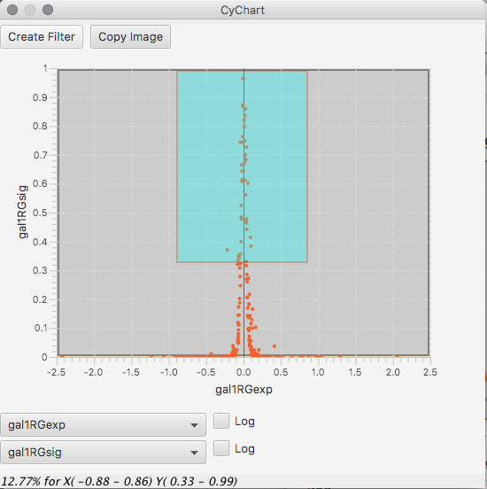

# cyChart 

This is a graphical interface to the filter mechanism found in Cytoscape's Select tab.

Right click on a numerical column and select Histogram Filter...

A plot will appear.  Drag within the plot area to create an H shaped selection field.  Drag either end or the middle to edit the field.  

You can also get to this window from Tools >> Histogram Filter...

There is a two dimension scatter plot also available via Tools >> Scatter Filter....

Both the scatter and histogram filters will support you to create a filter in the Select control panel.  They both will save their state as a PNG image.
